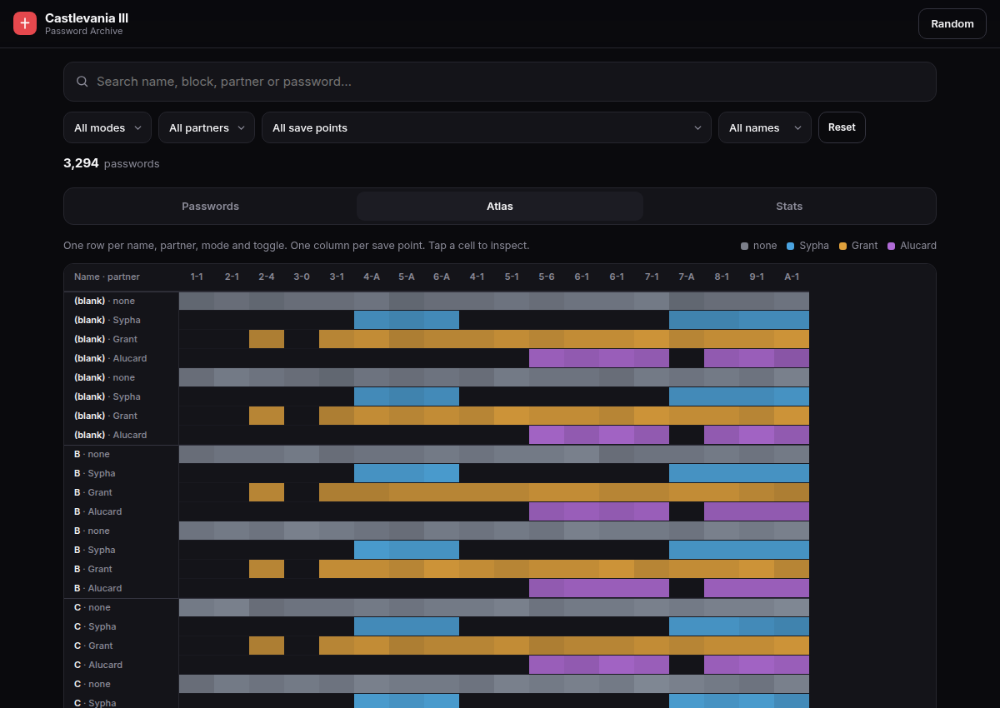
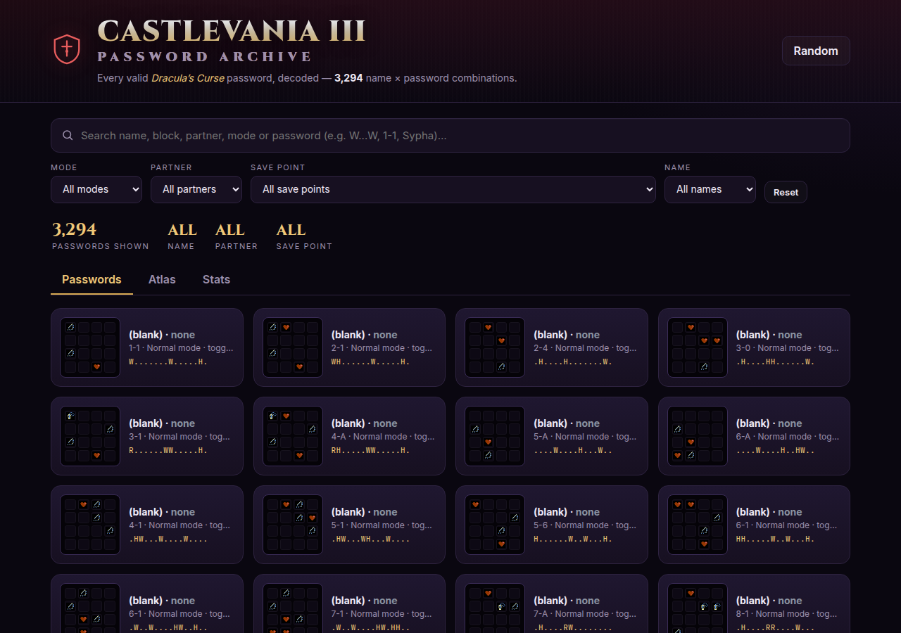

# Castlevania III — Password Archive

A little web app for searching and visualising **all 3,294 valid passwords** for
*Castlevania III: Dracula's Curse* (NES).

The password data is generated from the game's reverse-engineered name-and-password
scheme, so it stays complete, consistent and reproducible — no scraped lists.



## Features

- **Search everything** — name, block, partner, mode, or a password fragment such as
  `W...W` (`.` = blank, `W` = whip, `R` = rosary, `H` = heart).
- **Filter** by mode, partner, save point and name; every view respects the filters.
- **Passwords** — page through results as 4×4 password matrices with the real sprite marks.
- **Atlas** — the whole archive in one grid: one row per name / partner / mode / toggle
  combination, one column per save point. Hover a cell for its code, click to inspect.
- **Stats** — live distributions of passwords per save point, partner, mode and mark count.
- **Deep links** — every game state has a shareable URL (`?id=…`), and filters live in the
  query string too.
- Random password button, copy password, copy link, dark Castlevania-flavoured UI.



## Run locally

The app is plain HTML/CSS/JS with no build step, but it fetches `data/passwords.json`,
so it must be served over HTTP:

```bash
npm run serve      # python3 -m http.server 8080
# then open http://localhost:8080
```

## Regenerate / verify the data

```bash
npm run generate   # writes data/passwords.json (3,294 entries)
npm run verify     # round-trip decodes every password back to its game state
```

`scripts/cv3.mjs` implements the encoding and decoding. `scripts/generate.mjs` builds
the full name × partner × mode × toggle × save-point table; `scripts/verify.mjs`
independently decodes each result and asserts it matches the source state.

## Deploy

The repository is a plain static site and is published with **GitHub Pages**.
Enable **Settings → Pages → Deploy from a branch → `main` / `/ (root)`** and it
will be live at `https://<user>.github.io/castlevania/`.

## Credits & license

- Password algorithm reverse engineered and documented by **meatfighter**:
  <https://meatfighter.com/castlevania3-password/> (CC BY-SA 4.0). The generator in
  `scripts/` is a JavaScript port of that work. Sprite images under `assets/sprites/`
  come from the same project.
- Castlevania and all related characters are trademarks of **Konami**. This is an
  unofficial fan project and is not affiliated with or endorsed by Konami.
